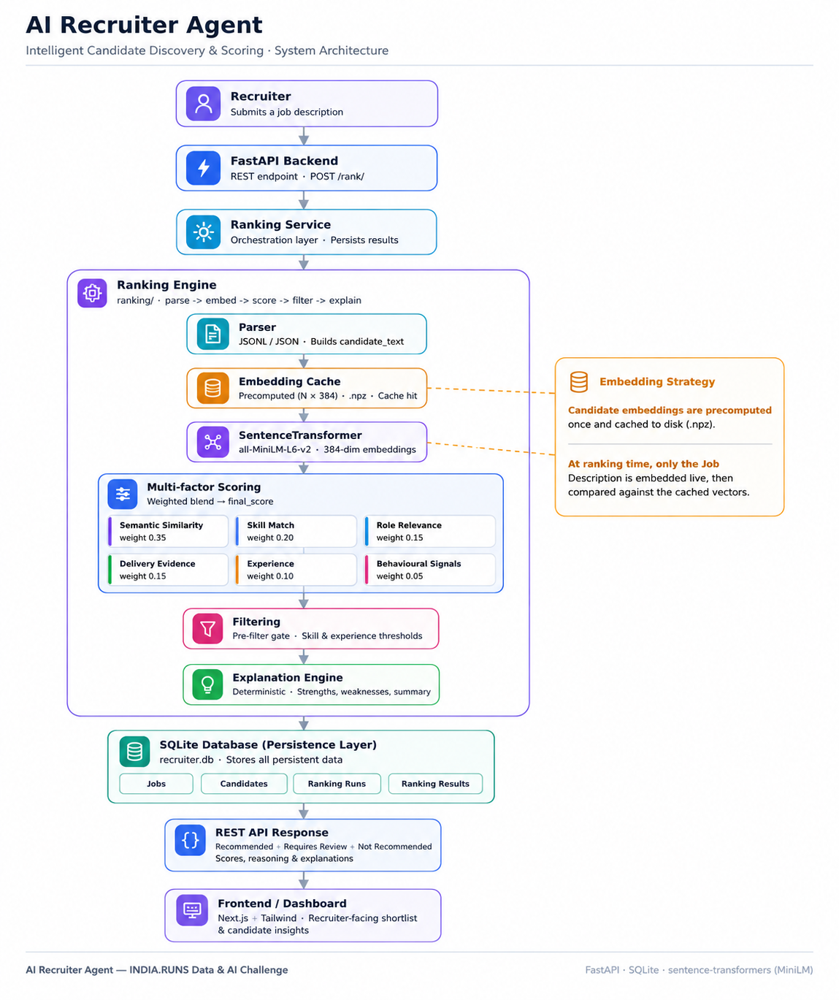

# AI Recruiter Agent

Semantic candidate ranking system that scores an entire talent pool against a job description and returns ranked, explainable shortlists through a REST API.

Traditional keyword-search tools miss qualified candidates who use different terminology and surface irrelevant candidates who have learned to pack their resumes with buzzwords. This system replaces keyword matching with a six-signal scoring pipeline built on sentence-transformer embeddings, grounding every ranking decision in measurable evidence rather than surface-level text overlap.

The ranking engine distinguishes practitioners who have shipped machine learning systems in production from candidates who are interested in AI but have not delivered it. Every decision — Recommended, Requires Review, or Not Recommended — comes with a confidence score, matched and missing skills, natural-language strengths and weaknesses, and a plain-English recruiter summary, all generated deterministically without any LLM API calls.

The architecture supports datasets of 100,000 candidates or more through a disk-based embedding cache that reduces per-request embedding work from N+1 texts to a single job-description encode, and a memory optimization that strips roughly 400 MB of text blobs from scored records before the explanation pass begins.

---

## Why AI Recruiter Agent?

AI Recruiter Agent is an AI-powered candidate ranking platform that helps recruiters identify the most relevant candidates from large talent pools using semantic search, explainable multi-factor scoring, and recruiter-friendly reasoning.

Unlike traditional Applicant Tracking Systems (ATS) that rely on keyword matching, this system evaluates semantic similarity, technical skills, role relevance, production experience, delivery evidence, and behavioural signals to produce transparent hiring recommendations.
---

## Project Overview

Hiring teams reviewing large candidate pools face two compounding problems: keyword-based ATS filters eliminate qualified candidates whose resumes do not use the exact search terms, and they still require a recruiter to read through every passing resume individually. This system addresses both.

The ranking engine embeds the full candidate profile — headline, summary, career descriptions, skills, education, and certifications — into a 384-dimensional vector and computes cosine similarity against the job description. Semantic similarity alone is insufficient because "AI enthusiast" language inflates similarity scores for non-practitioners. The pipeline therefore blends five additional signals: explicit skill coverage, role relevance by career domain, production delivery evidence, years of experience, and behavioral engagement from the platform.

A pre-filter gate eliminates candidates below 15% required-skill coverage or below 75% of the required experience level before ranking begins, mirroring how a human recruiter triages a candidate pool. Candidates near the threshold go to a Requires Review bucket rather than hard rejection, preserving borderline talent for human judgment.

The explanation engine derives structured output — strengths, weaknesses, decision rationale, and a recruiter narrative — from the numeric scoring signals using rule-based logic. No LLM call is required; every field is reproducible and auditable from the same inputs.

---

## Project Highlights

- Supports datasets of 100,000+ candidates
- CPU-only ranking pipeline
- Deterministic results across repeated runs
- Explainable AI with recruiter-readable reasoning
- FastAPI REST API
- Precomputed embedding cache for high performance
- SQLite persistence
- Hackathon-ready submission generator

---

## Key Features

### AI Ranking Engine

- Six-signal scoring formula (v4) blending semantic similarity, skill match, role relevance, delivery evidence, experience, and behavioral signals
- `all-MiniLM-L6-v2` sentence-transformer model producing L2-normalised 384-dimensional embeddings where dot product equals cosine similarity
- Pre-filter gate with configurable thresholds that eliminates domain-wrong candidates before ranking
- Three-bucket output: Recommended, Requires Review, Not Recommended
- Deterministic sort key `(-final_score, candidate_id)` guarantees identical output on identical input regardless of floating-point thread scheduling
- 80+ technology alias normalisations (e.g., `torch` → `pytorch`, `wandb` → `weights & biases`, `qlora` → `lora`) applied symmetrically to both job description and candidate skills

### Explainable AI

- Every candidate receives a decision, a confidence score (0–100), matched skills, missing skills, rule-based strengths, rule-based weaknesses, a one-sentence decision rationale, and a 2–3 sentence recruiter narrative
- No LLM calls — all explanations are derived from the six numeric scoring signals via deterministic rule-based logic
- Four candidate categories (CORE_ML, ML_ADJ, ENG, NON_TECH) derived from job title tier lookup provide domain classification context
- `filter_reason` field records exactly which threshold a rejected candidate failed

### FastAPI Backend

- Full CRUD REST API for jobs, candidates, and scores over SQLite
- `POST /rank/` endpoint accepts a job description and returns a complete ranked response with three decision buckets
- Automatic interactive API documentation at `/docs` (Swagger UI)
- `GET /health` endpoint for liveness checks
- CORS middleware configured for cross-origin frontend integration
- Pydantic v2 models with `from_attributes = True` for direct SQLite row serialisation
- Database initialised at startup via lifespan context manager using `db/init.sql`

### Scalable Architecture

- Process-level candidate cache in `parser.py` parses the dataset once per server process and serves all subsequent requests from memory — no disk I/O after first load
- Disk-based embedding cache (`data/candidates_embeddings.npz`) stores pre-computed float32 `(N, 384)` arrays; cache freshness is keyed by source file `mtime` and size
- On cache hit, only the job description is embedded (1 text vs N+1), reducing embedding work by orders of magnitude on large datasets
- `not_recommended` bucket is omitted from the API response body at scale — the count is preserved in the summary; tens of thousands of rejected records are not serialised
- Memory optimisation in `ranking_service.py` strips large text fields (`candidate_text`, `career_text`, `summary`, `career_titles`) from scored dicts before the explanation pass, freeing approximately 400 MB on 100K-candidate runs

### Submission Pipeline

- `submission/submit.py` generates a hackathon-format CSV with exactly 100 ranked candidates from the full pool
- Auto-generates unique filenames in the format `<JobTitle>_<YYYYMMDD_HHMMSS>.csv`
- Appends every run to `submission/submission_history.csv` for audit tracking
- Automatically invokes `submission/validate_submission.py` after each generation
- `torch.manual_seed(0)` and `torch.use_deterministic_algorithms(True)` are set before the JD embedding step to eliminate BLAS floating-point non-determinism across runs
- No filter gate in submission mode — all 100K candidates are ranked globally to guarantee exactly 100 rows

### Performance Optimizations

- `ranking/benchmark.py` measures total time, embedding time, non-embedding time, peak memory delta, and throughput for both inline and cached execution paths
- `ranking/preprocess.py` CLI pre-computes and caches all candidate embeddings as a one-time setup step before the server starts
- Windows console compatibility: all print output in `ranking/` uses ASCII only to avoid `UnicodeEncodeError` on `cp1252` terminals
- Model loaded once as a module-level singleton in `scorer.py` — no reload between requests

---

## Architecture



---

## Ranking Process

Recruiter uploads a Job Description

↓

System extracts required skills

↓

Candidate embeddings are compared semantically

↓

Multi-factor scoring

↓

Top candidates shortlisted

↓

Explanation generated

↓

REST API returns ranked shortlist

↓

Frontend displays recruiter dashboard

## Ranking Pipeline

```
Recruiter
    |
    v
Job Description
    |
    v
Parser (ranking/parser.py)
    |  Loads candidates.jsonl or sample_candidates.json
    |  Builds candidate_text embedding blob per candidate
    |  Process-level cache: parsed once, reused for all requests
    |
    v
Embedding Cache Check (ranking/cache.py)
    |
    +-- Cache HIT  --> Load (N, 384) float32 from .npz
    |                  Embed job description only (1 text)
    |
    +-- Cache MISS --> Embed job description + all candidates
                       (N+1 texts, batched)
    |
    v
Semantic Scoring (ranking/scorer.py)
    |  cosine_score = candidate_embeddings @ job_embedding
    |  skill_match_score   (required skills coverage)
    |  role_relevance_score (title/career tier lookup)
    |  delivery_evidence_score (production language vs aspiration language)
    |  experience_score (years vs required, capped at 1.0)
    |  behavioural_score (open_to_work, interview rate, github, completeness)
    |
    v
Multi-Factor Score Formula (v4)
    |  final = 0.35 * semantic
    |        + 0.20 * skill_match
    |        + 0.15 * role_relevance
    |        + 0.15 * delivery_evidence
    |        + 0.10 * experience
    |        + 0.05 * behavioural
    |
    v
Pre-Filter Gate (ranking/rank.py)
    |  MIN_SKILL_MATCH      >= 0.15
    |  MIN_EXPERIENCE_SCORE >= 0.75
    |
    +-- Passing  --> ranked by (-final_score, candidate_id)
    +-- Rejected --> assigned to Requires Review or Not Recommended
    |
    v
Explanation Engine (ranking/explainer.py)
    |  assign_decision(), compute_confidence()
    |  get_strengths(), get_weaknesses()
    |  generate_recruiter_summary()
    |  No LLM calls -- all rule-based from numeric signals
    |
    v
SQLite Persistence (services/ranking_service.py)
    |  ranking_runs  -- one row per /rank/ call
    |  ranking_results -- one row per candidate per run
    |
    v
REST API Response (POST /rank/)
    |  recommended     (top shortlist_size candidates)
    |  requires_review (borderline, up to shortlist_size * 2)
    |  not_recommended (count only, body omitted at scale)
    |  summary         (aggregate stats)
    |
    v
Frontend / Recruiter Dashboard
```

---

## Multi-Factor Scoring

| Signal | Weight | Description |
|---|---|---|
| Semantic Similarity | 35% | Cosine similarity between the L2-normalised job description embedding and the candidate profile embedding. Captures holistic fit across all profile sections. Reduced from v2 because boilerplate AI-interest language inflates raw similarity for non-practitioners. |
| Skill Match | 20% | Fraction of required skills extracted from the job description that the candidate covers. One-sided (job-perspective): extra candidate skills do not inflate the score. 80+ technology aliases are normalised to canonical names before comparison. |
| Role Relevance | 15% | Domain classification score from a keyword-tier lookup over current title (60%), last three career titles with recency weighting (30%), and headline (10%). Four tiers: core ML/AI (1.0), ML-adjacent (0.70), software engineering (0.40), non-technical (0.05). |
| Delivery Evidence | 15% | Distinguishes candidates who have shipped production ML systems from those who are learning or experimenting. Scans summary and career description prose for strong-evidence phrases ("deployed", "in production", "led the team") and weak-evidence phrases ("side project", "kaggle", "online courses"). Formula: `clip(strong_count * 0.20 - weak_count * 0.10, 0, 1)`. |
| Experience | 10% | Normalised ratio of candidate years to required years, capped at 1.0. Partial credit is given below the minimum. The pre-filter gate already enforces a hard floor, so this signal mainly differentiates within the passing pool. |
| Behavioural Signals | 5% | Engagement signals from the platform: open-to-work flag (30%), interview completion rate (30%), GitHub activity score normalised to [0, 1] (20%), profile completeness (20%). Weight reduced to 0.05 so strong engagement cannot compensate for domain mismatch. |
| **Final Score** | **100%** | Weighted sum of all six signals, in [0, 1]. Used as primary sort key with `candidate_id` as the deterministic tie-breaker. |

---

## Explainability

Every candidate returned by `POST /rank/` receives the following fields in the `CandidateResult` response model.

**Decision** — one of three mutually exclusive outcomes:

| Decision | Criteria |
|---|---|
| Recommended | Passed the pre-filter gate AND ranked within `shortlist_size` |
| Requires Review | Passed the filter but ranked outside `shortlist_size`; OR failed filter with `skill_match >= 0.10` and a technical career category |
| Not Recommended | Failed filter with `skill_match < 0.10` OR non-technical domain (NON_TECH) |

**Confidence Score** — maps `final_score` to a recruiter-readable 0–100 percentage. Calibrated against v4 score distributions: scores above 0.60 map to 90–100%, 0.45–0.60 to 70–89%, 0.35–0.45 to 50–69%, 0.25–0.35 to 30–49%, below 0.25 to 0–29%.

**Strengths** — ordered list of plain-English statements derived from the six scoring signals. Prioritised from most impactful (domain identity as CORE_ML or ML_ADJ) through production delivery evidence, semantic alignment, skill coverage, career trajectory, experience level, and availability signals.

**Weaknesses** — ordered list of plain-English statements identifying gaps. Prioritised from most critical (domain mismatch, non-technical background) through skill coverage gaps, missing required skills (up to 6 previewed), absent delivery evidence, low role relevance, poor semantic alignment, and experience shortfall.

**Recruiter Summary** — a template-generated 2–3 sentence narrative combining candidate identity (name, title, company, years of experience), domain category, skill coverage, and decision rationale. Generated without any LLM calls.

**Decision Reasoning** — one sentence explaining why the specific decision was assigned. Only the field matching the decision is non-null (`reason_for_recommendation`, `reason_for_rejection`, or `reason_for_review`).

---

## API Documentation

### Health

#### `GET /health`

Returns server status and API version.

**Response**
```json
{
  "status": "ok",
  "version": "0.1.0"
}
```

---

### Ranking

#### `POST /rank/`

Runs the v4 ranking pipeline over the full candidate dataset. Returns all candidates assigned to exactly one of three decision buckets. Results are persisted to `ranking_runs` and `ranking_results`.

**Request**
```json
{
  "job_description": "Senior Machine Learning Engineer with 4+ years experience in Python, PyTorch, fine-tuning LLMs, MLflow, and production deployment.",
  "shortlist_size": 10,
  "job_id": null
}
```

| Field | Type | Required | Description |
|---|---|---|---|
| `job_description` | string (min 20 chars) | Yes | Full text of the job posting |
| `shortlist_size` | integer (1–200) | No (default: 10) | Number of candidates in the Recommended bucket |
| `job_id` | integer or null | No | Optional link to a jobs table record |

**Response**
```json
{
  "summary": {
    "total_candidates": 100000,
    "recommended_count": 10,
    "requires_review_count": 47,
    "not_recommended_count": 99943,
    "average_match_score": 0.1823,
    "average_experience_years": 4.7,
    "most_common_matched_skills": ["python", "pytorch", "llm"],
    "most_common_missing_skills": ["mlflow", "rlhf", "lora"],
    "required_skills_count": 8
  },
  "recommended": [
    {
      "candidate_id": "CAND_0042891",
      "name": "Candidate Name",
      "current_title": "Senior ML Engineer",
      "current_company": "Tech Company",
      "location": "Bangalore, India",
      "country": "India",
      "years_of_experience": 6.0,
      "candidate_category": "CORE_ML",
      "decision": "Recommended",
      "confidence_score": 91.4,
      "matched_skills": ["python", "pytorch", "llm", "fine-tuning"],
      "missing_skills": ["mlflow", "rlhf"],
      "strengths": [
        "Core ML/AI practitioner - current role is directly in the target domain",
        "Strong evidence of shipping ML systems to production",
        "High skill coverage: 6/8 required skills matched (75%)"
      ],
      "weaknesses": [
        "Missing required skills: mlflow, rlhf"
      ],
      "reason_for_recommendation": "Recommended based on core ML/AI career background, 6/8 required skills matched, strong production delivery evidence.",
      "reason_for_rejection": null,
      "reason_for_review": null,
      "recruiter_summary": "...",
      "scores": {
        "semantic": 0.7312,
        "skill_match": 0.75,
        "role_relevance": 0.9200,
        "delivery_evidence": 0.80,
        "experience": 1.0,
        "behavioural": 0.64,
        "final": 0.6318
      },
      "rank": 1,
      "filter_reason": null
    }
  ],
  "requires_review": [ "..." ],
  "not_recommended": []
}
```

> `not_recommended` is always an empty list in the response body. The count is available in `summary.not_recommended_count`. This design prevents serialising tens of thousands of records on large datasets.

---

### Jobs

#### `GET /jobs/`

Returns all job records ordered by creation date descending.

#### `GET /jobs/{job_id}`

Returns a single job record. Returns 404 if not found.

#### `POST /jobs/`

Creates a new job record.

**Request**
```json
{
  "title": "Senior ML Engineer",
  "company": "Acme Corp",
  "description": "We are hiring...",
  "requirements": "4+ years of ML experience",
  "location": "Bangalore",
  "salary_min": 2000000,
  "salary_max": 3500000,
  "status": "active"
}
```

#### `PATCH /jobs/{job_id}`

Partially updates a job record. Only fields provided are updated.

#### `DELETE /jobs/{job_id}`

Deletes a job record. Returns 204 on success.

---

### Candidates

#### `GET /candidates/`

Returns all candidate records ordered by creation date descending.

#### `GET /candidates/{candidate_id}`

Returns a single candidate record. Returns 404 if not found.

#### `POST /candidates/`

Creates a new candidate record. Returns 409 if the email address is already registered.

**Request**
```json
{
  "name": "Candidate Name",
  "email": "candidate@example.com",
  "phone": "+91-9876543210",
  "location": "Bangalore",
  "resume_text": "...",
  "skills": "Python, PyTorch, MLflow",
  "experience_years": 5,
  "education": "B.Tech Computer Science",
  "linkedin_url": "https://linkedin.com/in/example",
  "github_url": "https://github.com/example"
}
```

#### `PATCH /candidates/{candidate_id}`

Partially updates a candidate record.

#### `DELETE /candidates/{candidate_id}`

Deletes a candidate record. Returns 204 on success.

---

### Scores

#### `POST /scores/`

Creates a score entry for a job/candidate pair with status `pending`. Returns 409 if the pair already exists.

**Request**
```json
{
  "job_id": 1,
  "candidate_id": 42
}
```

#### `GET /scores/{score_id}`

Returns a single score record.

#### `GET /scores/job/{job_id}`

Returns all score records for a job, ordered by overall score descending.

#### `GET /scores/job/{job_id}/ranked`

Returns scored candidates for a job joined with candidate name and email, ordered by overall score descending and annotated with rank position.

#### `DELETE /scores/{score_id}`

Deletes a score record. Returns 204 on success.

---

## Folder Structure

```
ai-recruiter-agent/
|
|-- main.py                         FastAPI application: routers, middleware, lifespan
|-- database.py                     SQLite connection factory with row_factory and FK support
|-- requirements.txt                Pinned Python dependencies
|
|-- db/
|   +-- init.sql                    Schema: jobs, candidates, scores, ranking_runs,
|                                   ranking_results, six indexes
|
|-- routers/
|   |-- jobs.py                     CRUD for jobs (GET, POST, PATCH, DELETE)
|   |-- candidates.py              CRUD for candidates
|   |-- scores.py                   Score management, ranked candidate queries
|   +-- ranking.py                 Thin HTTP handler for POST /rank/
|
|-- models/
|   |-- job.py                      JobCreate, JobUpdate, JobResponse
|   |-- candidate.py               CandidateCreate, CandidateUpdate, CandidateResponse
|   |-- score.py                    ScoreCreate, ScoreResponse, RankedCandidate
|   +-- ranking_response.py        RankRequest, RankingResponse, RankingSummary,
|                                   CandidateResult, ScoreBreakdown
|
|-- services/
|   |-- ranking_service.py         Sole orchestration layer: runs pipeline, strips
|   |                               memory, builds explanations, persists to SQLite,
|   |                               assembles RankingResponse
|   +-- gemini.py                  Gemini integration stub (named placeholder)(Not used in current implementation)
|
|-- ranking/
|   |-- parser.py                   Dataset loader (JSONL and JSON), candidate_text
|   |                               builder, process-level module cache
|   |-- scorer.py                   v4 scoring engine: six signals, formula weights,
|   |                               80+ tech normalisations, two public entry points
|   |-- rank.py                     Pipeline orchestrator: cache check, score, filter,
|   |                               sort; run_ranking() and run_evaluation() entry points
|   |-- explainer.py               Deterministic explanation generator: decisions,
|   |                               confidence, strengths, weaknesses, summaries
|   |-- cache.py                    Disk-based .npz embedding cache with mtime+size
|   |                               freshness check
|   |-- preprocess.py              One-time CLI to pre-compute and cache all embeddings
|   |-- benchmark.py               Performance measurement: inline vs cached, wall time,
|   |                               embedding time, peak memory, throughput
|   +-- test.py                     CLI smoke test and leaderboard display
|
|-- submission/
|   |-- submit.py                   Submission generator: 100-row CSV, auto-naming,
|   |                               deterministic seeding, validation invocation,
|   |                               history logging
|   |-- validate_submission.py     Validator: columns, row count, rank integrity,
|   |                               score range, candidate_id uniqueness, reasoning
|   +-- submission_history.csv     Append-only log of every generated submission
|
+-- data/
    |-- candidates.jsonl            Full candidate dataset (production)
    |-- sample_candidates.json      Development sample
    |-- candidates_embeddings.npz   Pre-computed float32 (N, 384) embedding cache
    +-- candidate_schema.json       Dataset field schema reference
```

---

## Installation

**Clone the repository**
```powershell
git clone <repository-url>
cd ai-recruiter-agent
```

**Create and activate a virtual environment**
```powershell
python -m venv .venv
.venv\Scripts\Activate.ps1
```

**Install dependencies**
```powershell
pip install fastapi uvicorn[standard] pydantic[email] sentence-transformers numpy
```

Or install from the requirements file:
```powershell
pip install -r requirements.txt
pip install sentence-transformers numpy
```

**Pre-compute candidate embeddings (run once per dataset)**

This step pre-computes and caches embeddings for all candidates. It is required before starting the server on a new dataset, and before generating a submission.

```powershell
python -m ranking.preprocess
# or explicitly:
python -m ranking.preprocess --input data/candidates.jsonl
```

**Start the FastAPI server**
```powershell
uvicorn main:app --reload
```

The database schema is initialised automatically on first startup. API documentation is available at `http://localhost:8000/docs`.

**Run the ranking pipeline from the CLI**
```powershell
# Standard top-20 leaderboard
python -m ranking.test

# Evaluation mode: before/after filter comparison
python -m ranking.test --eval
```

**Benchmark performance**
```powershell
# Full benchmark: inline path vs cached path
python -m ranking.benchmark

# Against a specific dataset
python -m ranking.benchmark --input data/candidates.jsonl
```

**Generate a hackathon submission CSV**
```powershell
# Inline job description — auto-generates submission/<Title>_<YYYYMMDD_HHMMSS>.csv
python -m submission.submit --jd "Senior Machine Learning Engineer with Python, NLP, FAISS"

# Job description from file
python -m submission.submit --jd data/job_description.docx

# Explicit output path
python -m submission.submit --jd data/job_description.docx --output my_submission.csv
```

---

## Performance

| Metric | Detail |
|---|---|
| Candidate Scale | Designed and tested for datasets up to 100,000 candidates |
| Embedding Cache | Disk-based `.npz` (float32, N x 384). Validated by source file `mtime` and `size`. One-time setup via `ranking.preprocess`. |
| Cache Hit Runtime | Embeds only the job description (1 text). All candidate embeddings loaded from disk. |
| Cache Miss Runtime | Embeds job description and all N candidates in batched passes. Used as automatic fallback when cache is absent or stale. |
| Hardware Requirement | CPU only — no GPU required. The `all-MiniLM-L6-v2` model is efficient on CPU. |
| Memory Optimisation | Large text fields (`candidate_text`, `career_text`, `summary`, `career_titles`) stripped from scored dicts before the explanation pass, freeing approximately 400 MB on 100K-candidate runs. |
| Process Cache | Candidate dataset parsed once per server process and held in a module-level dict. Zero disk I/O for subsequent requests in the same process. |
| Submission Validation | Automatic. `validate_submission.py` runs as a subprocess after every `submit.py` invocation and enforces: 100 rows, unique ranks 1–100, scores in [0, 1], non-empty candidate IDs, non-empty reasoning. |
| Determinism | Submission pipeline seeds `torch.manual_seed(0)` and `numpy.random.seed(0)` before JD embedding. Identical inputs produce identical rank order across runs. |

To measure actual throughput numbers for your hardware and dataset size, run:
```powershell
python -m ranking.benchmark --input data/candidates.jsonl
```

---

## Demo

### Swagger API

![Swagger UI][def]
![Swagger UI][docs/images/]
[def]: docs/images/swagger_fullWebsite.png


---

## Technologies Used

| Technology | Role |
|---|---|
| Python 3.11+ | Core language |
| FastAPI 0.115 | REST API framework, OpenAPI documentation |
| Uvicorn | ASGI server |
| SQLite | Embedded database (five tables, six indexes) |
| Pydantic v2 | Request/response validation and serialisation |
| SentenceTransformers | `all-MiniLM-L6-v2` embedding model |
| NumPy | Embedding matrix operations, cosine similarity, cache storage |
| PyTorch | Underlying model runtime (transitive); used directly for deterministic seeding in submission pipeline |

---

## Future Roadmap

The following are areas of planned development and are not yet implemented.

- **Resume Parsing** — direct PDF and DOCX ingestion so candidates do not need to manually enter structured data
- **ATS Integration** — connectors to popular Applicant Tracking Systems to import candidate pools and export ranked shortlists
- **Authentication** — API key or OAuth2 authentication layer for multi-tenant deployment
- **Recruiter Dashboard** — web frontend for submitting job descriptions, browsing ranked candidates, and reviewing explanations
- **Analytics** — per-run trend tracking, skill-gap analysis across the candidate pool, and coverage reports
- **Enterprise Deployment** — containerised deployment with Docker and Kubernetes manifests, environment-based configuration, and health-check endpoints for orchestration
- **Vector Database** — migration from `.npz` flat-file cache to a purpose-built vector store (such as FAISS, Pinecone, or Milvus) for sub-second approximate nearest-neighbour queries at multi-million candidate scale
- **Gemini Integration** — the `services/gemini.py` stub is a named placeholder for a future LLM-assisted explanation enrichment pass

---

## License

MIT

---

## Acknowledgements

This project was built for the **Hack2Skill** AI hackathon.

The semantic ranking layer is built on the [Sentence Transformers](https://www.sbert.net/) library by UKPLab and the `all-MiniLM-L6-v2` model, which provides an efficient balance of embedding quality and CPU inference speed.

The broader open-source Python ecosystem — FastAPI, Pydantic, NumPy, and SQLite — made it possible to build a production-quality pipeline without proprietary dependencies.


[def]: docs/images/swagger_fullWebsite.png
